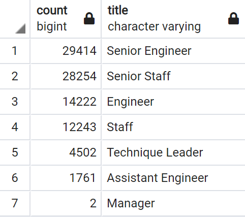

# Pewlett-Hackard-Analysis

## Project Overview

We are performing analysis on the information of all employees at a company called Pewlett Hackard. Specifically, we are determining how many employees are expected to retire soon as well as how we should plan to replace them. This analysis was performed using PostgreSQL and pgAdmin4.

## Results

- 
- The two job positions with the most upcoming retirees are Senior Engineer and Senior Staff. 
- Only 2 Managers are expected to retire soon.
- A total of 90,398 employees are expected to retire soon.
- A total of 1,549 employees are eligible to participate in a mentorship program.

## Summary

- How many roles will need to be filled as the "silver tsunami" begins to make an impact?
  - 90,398 employees are expected to retire soon and their roles will need to be filled.
- Are there enough qualified, retirement-ready employees in the departments to mentor the next generation of Pewlett Hackard employees?
  - There are 1,549 employees who are eligible to mentor the next generation. This does not seem like enough at all with over 90,000 employees retiring soon.
- The longest serving mentor-eligible employee is Oldrich Cyre who has been in their current position since 02/10/1985.
- The short serving mentor-eligible employee is Oscar Oppitz who has been in their current position since 07/27/2002.
